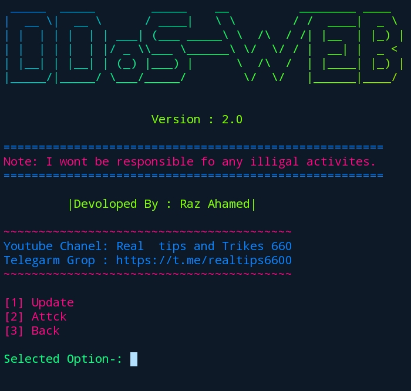

<h1>DDoS_WEB</h1>

<h5>This Tool only work http website and wifi admin panel jamming</h5>
<h3>OS</h3>
<h4>[1] linux &nbsp;
[2] Termux &nbsp;
[3] Windows</h4>
<h3>Install Linux / Termux</h3>

apt update -y

apt install git -y

apt install python -y 

git clone https://github.com/Raz-Ahamed/DDoS_WEB

cd DDoS_WEB

python3 start.py

<h1>Reach Out to me!</h1>
<h5>I am available in email and messenger. You can message me (except hi/hello), I will reply within 24 hours. I can help you with Python, shell, web application, android app development.</h5>

<h4>"Learning full stack development and app development. Check out my creative projects!"</h4>

<h3>Open for opportunities: Yes</h3>

</h5>
<h3>Made with ❤️ by Raz Ahamed</h3>

</body>
</html>
